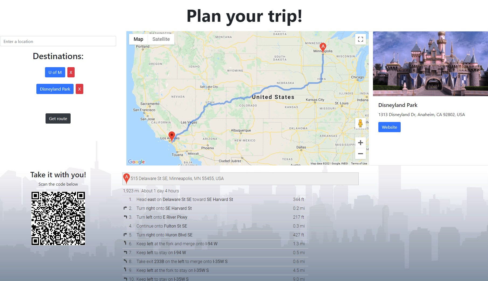

# portfolio-U02: Homework assignment 2

## Description

This is homework assignment 2

We were tasked with creating a personal portfolio from scratch that fit certain criteria.

It is important that it is responsive as well.

## Site link

The link to the deployed application can be found **[https://nathanhentges.github.io/code-refactor/](https://nathanhentges.github.io/code-refactor/)**.

## Website preview

Below is a screenshot preview of the final website.

